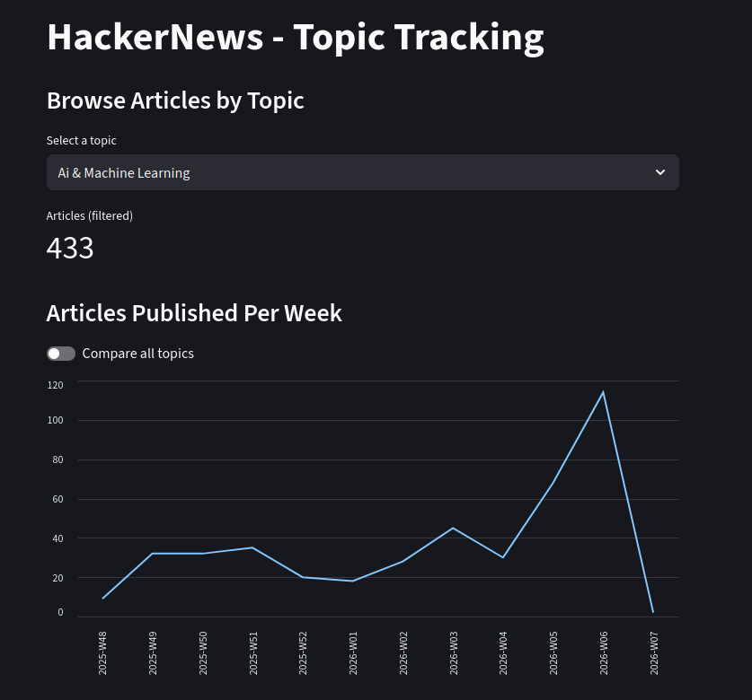
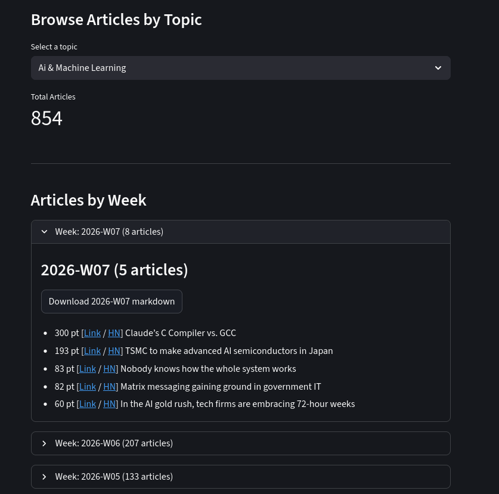

# Scientific Watch Tracking Tool


This app let you monitor:

- HackerNews topics
- Arxiv Papers



Note: in the graph, we have my "full history". Some bugs have been solved (not all articles were recovered at the beginning).


# Why?

It takes time to look Hacker News everyday => I prefer a weekly digest, with the trends


# How?

## How it Works?

Every hour/day, we download the newest articles/post.

We filter those that match our interest, and save the metadata (URL, title, abstract, ...) for later analysis.

## How it Filters?

**Boolean queries**. Fast and efficient. 

We consider:
  
- the title
- the full text (if possible)

There are some false positives, I filter it manually.

### How to Configure your own Queries?

Check existing ones in `queries/` folder.

OR Use the GUI to configure queries.


# GUI / Display the Results

To visualize the history of articles / posts (+ configure queries)

`cd app`

Launch the GUI:

`streamlit run app.py`

Inside, you can:

- See the history weeks after weeks
- Configure and test queries 




Note: the "collapse box count" is different from the "header count" 

- First one is for total count (unfiltered, almost, we set a minima of 30 points to avoid collecting ALL articles...)
- Second is for filtered articles (thanks to the widget in the GUI)

## Features

- Filter articles by points
- Download the report as markdown
- Get the chart week after week


# Install

## First Configuration

Create a virual environment if not exist.

`python3 -m venv my_watch_env`

Activate it 

`source my_watch_env/bin/activate`

Install dependencies

`pip3 install -r requirements.txt`

## Crontab

To set the data collection automatic, set a crontab:

`crontab -e`

And add these lines:

```sh
16 * * * * /<path>/<to>/<folder>/run_hn.sh >> /<path>/<to>/<folder>/logs/hn.log 2>&1                                                                                                                                                                                                                  
0 11 * * * /<path>/<to>/<folder>/run_arxiv.sh >> /<path>/<to>/<folder>/logs/arxiv.log 2>&1  
```

(We run HN every hour so we update the top articles, while we run arxiv once a day as changes are minimal).


Note: if the name of the virtual env is different, please update the `run_arxiv.sh` and `run_hn.sh`


# TODO

- [ ] TF IDF to investigate main topics / Filter articles more efficiently than rule base filter
- [ ] TSNE dataviz ?
- [ ] Arxiv: Better exploit the articles.